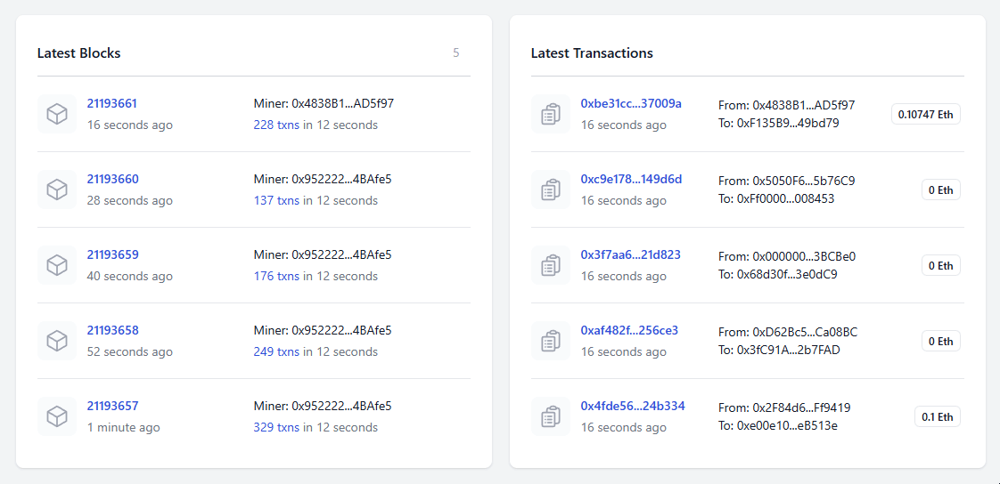
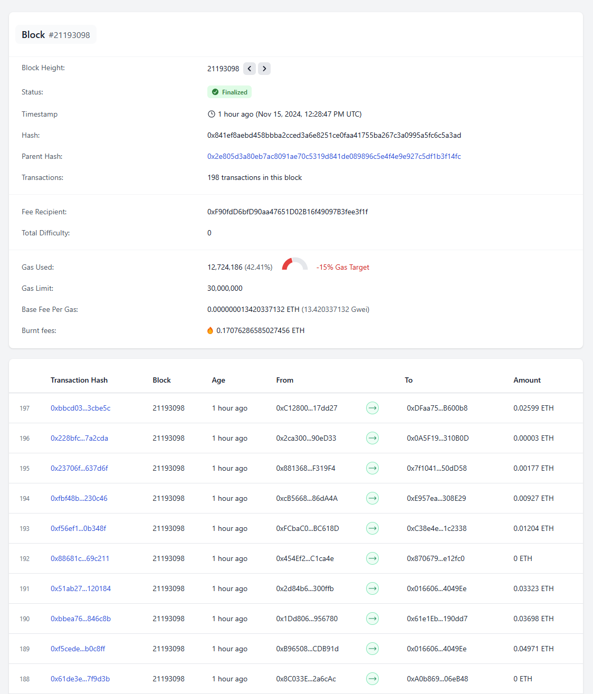
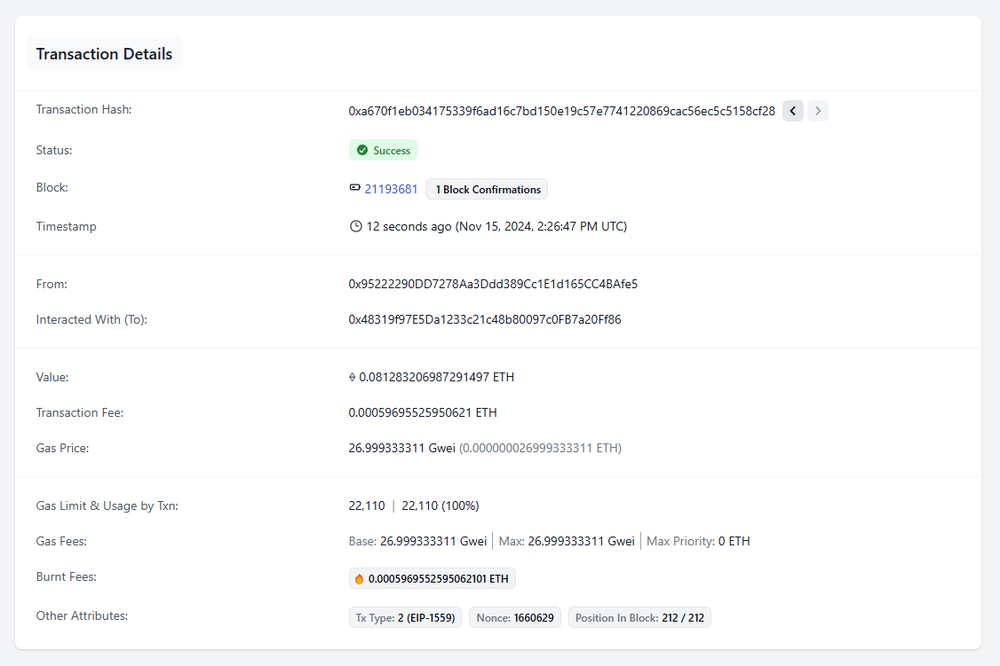

# Ethereum Block Explorer

Explore the latest blocks and transactions, as well as their details on the Ethereum blockchain, using the [Alchemy SDK](https://docs.alchemy.com/reference/alchemy-sdk-quickstart).





## Usage

#### Client ([React](https://react.dev/), [React Router](https://reactrouter.com/), [TanStack Query](https://tanstack.com/query/), [Vite](https://vite.dev/), [Tailwind CSS](https://tailwindcss.com/))

1. Open the `/client` folder from terminal.
2. Run `npm install` to install all the dependencies.
3. Run `npm run dev` to start the application .
4. Visit the application at http://localhost:5173/.

#### Server ([Express](https://expressjs.com/), [Alchemy SDK](https://docs.alchemy.com/reference/api-overview))

1. Open the `/server` folder from terminal.
2. Run `npm install` to install all the dependencies.
3. Create an Alchemy API Mainnet key as [described here](https://docs.alchemy.com/docs/alchemy-quickstart-guide).

   - Create an empty `.env` file and copy the contents of `.env.example`.
   - Replace `YOUR_ALCHEMY_API_KEY` with your key.

     ```
     ALCHEMY_API_KEY=YOUR_ALCHEMY_API_KEY
     ```

4. Run `npm run dev` to start the server.
